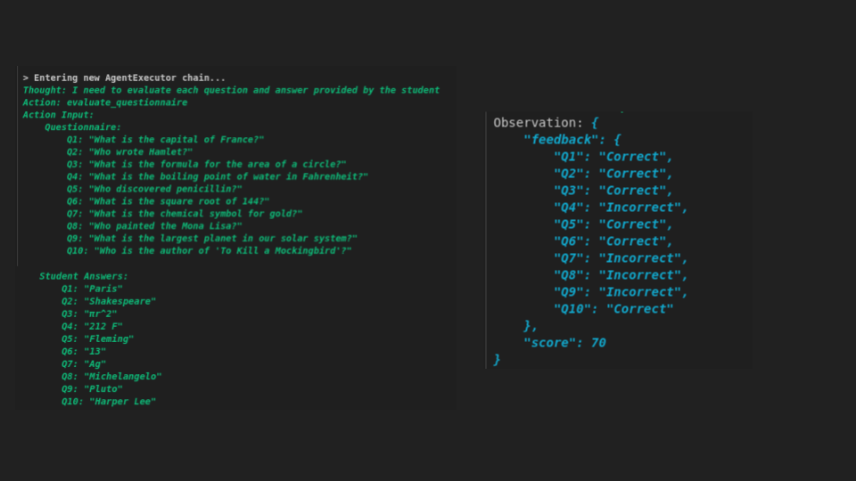
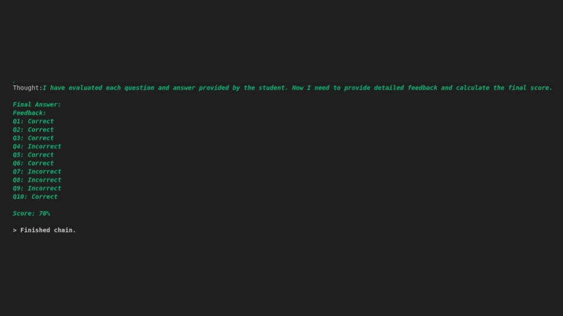

# Tutoring Assistant

This folder contains a **Tutoring Assistant** project that leverages [LangChain](https://github.com/hwchase17/langchain), [OpenAI’s GPT-3.5-Turbo](https://platform.openai.com/), and the **ReAct** (Reason + Act) framework to evaluate questionnaires, generate feedback, and assign scores to student responses. It’s part of the larger [ai-playground](https://github.com/guilhermemg/ai-playground) repository, which showcases various experimental AI projects and integrations.

---

## Table of Contents

1. [Overview](#overview)  
2. [Features](#features)  
3. [Project Structure](#project-structure)  
4. [Installation](#installation)  
5. [Usage](#usage)  
6. [Future Implementations](#future-implementations)  
7. [License](#license)  
8. [Contact](#contact)

---

## Overview

This Tutoring Assistant is an experimental project designed to **evaluate student questionnaire responses** using specialized LangChain Agents. The agents can:
- **Analyze** each answer for correctness and depth.
- **Generate** comprehensive feedback.
- **Calculate** a final score (as a percentage).

By integrating with tools like `llm-math` (for calculations) and `wikipedia` (for fact-checking), the system can reason step-by-step and make informed decisions dynamically.

---

## Features

- **ReAct Workflow**: Combines **Reason** and **Act** to orchestrate multi-step problem-solving using an LLM.  
- **Detailed Feedback Generation**: Each answer is evaluated, and suggestions for improvement are offered.  
- **Flexible Scoring**: Returns a percentage-based performance score for the entire questionnaire.  
- **Extensible Design**: The project’s modular structure makes it easy to add or swap out agents, tools, or prompts.

---

## Project Structure

Inside the `tutoring-assistant` folder, you’ll find:

    tutoring-assistant/ 
    ├── src/
        ├── tutoring_system.py 
        ├── quest_eval_agent.py 
        ├── generic_agent.py 
    └── notebooks/

**Key Files**  

1. **`tutoring_system.py`**  
   - Instantiates the Tutoring System.  
   - Configures the ChatOpenAI model (`gpt-3.5-turbo`).  
   - Provides a public method `evaluate_questionnaire` to generate feedback and scores.

2. **`quest_eval_agent.py`**  
   - Defines the `QuestionnaireEvaluatorAgent` for analyzing and scoring questionnaire responses.  
   - Inherits from the generic agent, leveraging specific prompts to create structured feedback.

3. **`generic_agent.py`**  
   - Houses the base `GenericAgent` class.  
   - Loads common tools (`llm-math`, `wikipedia`) and creates the final `ZeroShotAgent` with a ReAct prompt structure.

You may also have other supporting files such as `.env` for environment variables (API keys) and `requirements.txt` for dependencies, depending on your setup.

---

## Installation

1. **Clone the Repository** (if you haven’t already cloned the entire `ai-playground`):
   
   ```bash
   git clone https://github.com/guilhermemg/ai-playground.git
   cd ai-playground/tutoring-assistant
   ```

2. **Create and Activate a Virtual Environment (Optional)**

    ```bash
    conda create -n tutoring-assistant python=3.10
    conda activate tutoring-assistant
    ```

3. **Install Dependencies**
Install the dependencies based on the requirements.txt file presented in the _tutoring-assistant_ folder:

    ```bash
    pip install -r requirements.txt
    ```

4. **Set Up Environment Variables**

    Create a .env file (not committed to Git) and include your OpenAI API KEY:

    ```bash
    OPENAI_API_KEY=sk-xxxx
    ```


# Usage

Below is a sample code snippet demonstrating how to evaluate a student questionnaire using the Tutoring Assistant:

```python

    from tutoring_system import TutoringSystem

    questionnaire = """#####
    Questionnaire:
        Q1: "What is the capital of France?"
        Q2: "Who wrote Hamlet?"
        Q3: "What is the formula for the area of a circle?"
        Q4: "What is the boiling point of water in Fahrenheit?"
        Q5: "Who discovered penicillin?"
        Q6: "What is the square root of 144?"
        Q7: "What is the chemical symbol for gold?"
        Q8: "Who painted the Mona Lisa?"
        Q9: "What is the largest planet in our solar system?"
        Q10: "Who is the author of 'To Kill a Mockingbird'?"

    Student Answers:
        Q1: "Paris"
        Q2: "Shakespeare"
        Q3: "πr^2"
        Q4: "212 F"
        Q5: "Fleming"
        Q6: "13"
        Q7: "Ag"
        Q8: "Michelangelo"
        Q9: "Pluto"
        Q10: "Harper Lee"
    ######
    """

    tutor_system = TutoringSystem()

    evaluation_result = tutor_system.evaluate_questionnaire(questionnaire)    
```


When you run this code, you’ll receive detailed feedback on each answer as well as an overall score.

## Reasoning process:



## Final answer:




# Future Implementations
Looking ahead, here are potential enhancements and use cases:

* **Adaptive Curriculum Generation**: Dynamically produce tailored learning paths based on a student’s weak areas.
* **Real-Time Progress Tracking**: Compile performance metrics over multiple tests to visualize improvement.
* **Interactive Coach**: Integrate a conversational agent that offers hints and guidance during the test, not just after submission.
* **Multimedia Question Types**: Extend support to image, video, or audio-based queries and evaluate them similarly.
* **External API Integrations**: Incorporate specialized academic data, references, or real-time information for more accurate feedback.


# License

Unless otherwise specified, this project is available under an open-source license (e.g., MIT). Check the LICENSE file in the repository’s root for more details.


# Contact

Interested in learning more or collaborating on similar AI-driven projects?

I’d love to connect! Feel free to reach out on [LinkedIn](https://www.linkedin.com/in/ggadelha/) or [GitHub](https://github.com/guilhermemg) so we can explore new ideas, discuss potential opportunities, and continue pushing the boundaries of what's possible with AI.python